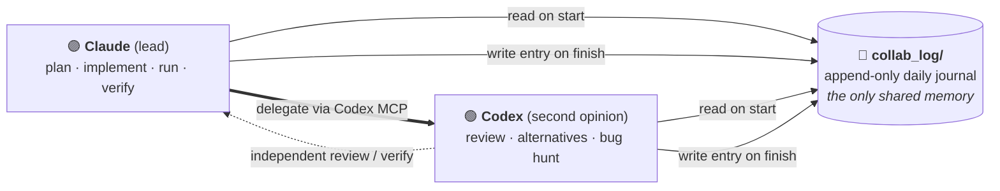

English | [繁體中文](README.zh-Hant.md)

# codex-collab

**A Claude Code skill that makes Claude and Codex co-own one project through a shared, append-only daily journal.**

Two AI coding agents work on the same repo: **Claude** (Anthropic, Claude Code) and **Codex** (OpenAI, Codex CLI). They don't share memory. Their only shared memory is a `collab_log/` folder of daily handoff entries that *both* agents read on start and write on finish.

This is **peer collaboration, not handoff.** Nobody is "leaving" and passing a baton. Both agents are equal authors of one living journal, with a defined division of labor and a verifiable handoff field on every entry.

And because every round is written down, you get to read the whole back-and-forth: who did what, what was verified, what's still open. **You stop being the messenger between two AIs and become the reviewer watching over both.**



---

## Why this exists

Plenty of tools let Claude and Codex talk to each other (MCP bridges) or let one session hand off to the next (handoff docs). What was missing is a lightweight, dependency-free, **peer co-ownership** model. Here's how it differs from the closest neighbors:

| Project | Mechanism | How codex-collab differs |
|---|---|---|
| Handoff skills (`HANDOFF.md`, etc.) | One-shot context doc for the *next* agent | Continuous co-ownership, not a one-time baton pass |
| `session-handoff` (`SESSION_LOG.md`) | Single overwritten file, session memory | **Per-day append-only files + index** (full history), peer division of labor, wires *both* `CLAUDE.md` and `AGENTS.md` |
| MCP bridges / Byterover | Call-and-respond, or external memory service | **Zero dependency.** Plain markdown in your repo, human-readable, git-friendly |
| Orchestrators (kanban, daemons, fleets) | Heavyweight multi-agent platforms | One skill + a folder. No infra. |

In short: the *mechanism* (a shared markdown log) isn't new. The **specific packaging** is: an append-only daily journal with a `did / verify / files / handoff` schema, peer framing, dual-file wiring, and Codex-MCP delegation, all in plain markdown.

---

## How it works

1. **Bootstrap once per project.** Creates `collab_log/INDEX.md` + today's day file, and pastes an "Always Do First" block into both `CLAUDE.md` (for Claude) and `AGENTS.md` (for Codex) so both agents are routed to the journal.
2. **On start.** Read `INDEX.md` (rules + the live `🔴 In progress / open threads` block + recent summaries) and today's day file.
3. **On finish.** Prepend an entry to today's day file and overwrite the open-threads block.
4. **Delegate to Codex.** Claude calls Codex via the Codex MCP for an independent second opinion / review / alternative, then logs the result.

The journal is **dual-track**: history is append-only (auditable, never edited), while the single "open threads" block is overwritten each session (always current, cheap to read).

### Default division of labor

- **Claude (lead):** planning, implementation, running the server, screenshot verification, writing the log.
- **Codex (second opinion):** code review, alternative approaches, bug hunting, copy/layout review, independent verification.

Adjustable per project, but "whoever touched what gets written to the log" is non-negotiable.

---

## Install

This is a Claude Code skill. Clone it into your skills directory:

```bash
git clone https://github.com/Thomas-Zhang-You-Wei/codex-collab.git ~/.claude/skills/codex-collab
```

Then in any project, tell Claude: **「啟動 codex 協作」** / "start codex collab" and it loads the skill.

### Requirements

- **Claude Code** with a **paid Claude plan** (Pro or Max), or Anthropic API billing. The skill runs here, and this is the only thing you have to pay for.
- **Codex CLI** registered as an MCP server, so Claude can delegate to it:
  ```bash
  claude mcp add --scope user codex -- codex mcp-server
  ```
- **A ChatGPT account for Codex (the free tier is enough).** Codex is included on the **free** ChatGPT plan (and Go/Plus/Pro/Business/Edu/Enterprise); the free tier just has a tighter rolling-window rate limit, so heavy back-to-back delegation may hit a brief pause. Sign in with your ChatGPT account, no API key required. ([OpenAI docs](https://help.openai.com/en/articles/11369540-using-codex-with-your-chatgpt-plan))

> **Cost in one line:** the only paid requirement is a Claude subscription. Codex runs on its free quota; you'd only need a paid ChatGPT plan if you regularly hit the free rate limit.

---

## Repo layout

```
codex-collab/
├── SKILL.md                     ← the skill (English; what Claude Code loads)
├── templates/                   ← English templates
│   ├── INDEX.template.md        ← collab_log index (rules + open-threads + day index)
│   ├── DAY.template.md          ← daily file template
│   ├── CLAUDE-snippet.md        ← paste into project CLAUDE.md (routes Claude to the log)
│   └── AGENTS-snippet.md        ← paste into project AGENTS.md (routes Codex to the log)
├── examples/
│   └── collab_log/              ← a worked example you can read to learn the format
└── i18n/
    └── zh-Hant/                 ← Traditional Chinese version (SKILL + templates + examples)
```

> Localization: the default `SKILL.md` and templates at the repo root are in **English**. A **Traditional Chinese (zh-Hant)** version lives in [`i18n/zh-Hant/`](i18n/zh-Hant/). To run the skill in Chinese, copy that folder's files over the root ones when cloning. Other language contributions welcome.

---

## License

MIT. See [LICENSE](LICENSE).
