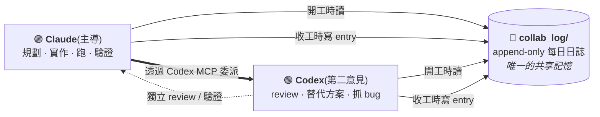

[English](README.md) | 繁體中文

# codex-collab

**一個 Claude Code skill,讓 Claude 和 Codex 透過一份共享、append-only 的每日日誌,共同擁有同一個專案。**

兩個 AI coding agent 在同一個 repo 上工作:**Claude**(Anthropic, Claude Code)與 **Codex**(OpenAI, Codex CLI)。它們不共享記憶,唯一的共同記憶是專案根目錄的 `collab_log/` 資料夾:一份每日交接日誌,**兩個 agent 開工時都讀、收工時都寫**。

這是 **對等協作(peer collaboration),不是交棒(handoff)**。沒有誰要「離開」並把棒子交給下一個。兩個 agent 是同一本活日誌的平等作者,有明確分工,每筆 entry 都帶一個可驗證的 handoff 欄位。

而且因為每一輪都被寫下來,你能讀到完整的來回:誰做了什麼、驗證了沒、還有什麼開著。**你不再是夾在兩個 AI 中間的傳話筒,而是變成在上面盯著它們的監督者。**



---

## 為什麼需要這個

讓 Claude 和 Codex 互相溝通的工具很多(MCP bridge),讓一個 session 交棒給下一個的也有(handoff 文件)。缺的是一個輕量、零依賴的 **對等共有(peer co-ownership)** 模型。跟最接近的skills比:

| 專案 | 機制 | codex-collab 的差別 |
|---|---|---|
| Handoff skills(`HANDOFF.md` 等) | 給「下一個」agent 的一次性 context 文件 | 持續共有,不是一次性交棒 |
| `session-handoff`(`SESSION_LOG.md`) | 單一覆寫檔、session 記憶 | **每日 append-only 日檔 + 索引**(完整歷史)、對等分工、同時接線 `CLAUDE.md` 與 `AGENTS.md` |
| MCP bridge / Byterover | 呼叫-回應,或外部記憶服務 | **零依賴**:純 markdown 放在你的 repo 裡,人類可讀、git 友善 |
| 編排器(kanban、daemon、fleet) | 重量級多 agent 平台 | 一個 skill + 一個資料夾,免架設 |

簡單說:**機制**(共享 markdown 日誌)不新,新的是**特定的打包方式**:append-only 每日日誌 + `did / verify / files / handoff` schema + 對等框架 + 雙檔接線 + Codex-MCP 委派,全部用純 markdown。

---

## 運作方式

1. **每個專案 bootstrap 一次**:建立 `collab_log/INDEX.md` + 今天的日檔,並把一段「Always Do First」貼進 `CLAUDE.md`(給 Claude)和 `AGENTS.md`(給 Codex),讓兩個 agent 都被導向日誌。
2. **開工**:讀 `INDEX.md`(規則 + live 的「🔴 現在進行中」區塊 + 最近摘要)和今天的日檔。
3. **收工**:在今天日檔最上方 prepend 一條 entry,並覆寫「現在進行中」區塊。
4. **委派 Codex**:Claude 透過 Codex MCP 找它要獨立的第二意見 / review / 替代方案,再把結果寫進日誌。

日誌是**雙軌**:歷史 append-only(可稽核、永不修改),而單一的「現在進行中」區塊每個 session 覆寫(永遠是最新、讀起來便宜)。

### 預設分工

- **Claude(主導):** 規劃、實作、跑 server、截圖驗證、寫日誌。
- **Codex(第二意見):** code review、替代方案、抓 bug、文案/排版審稿、獨立驗證。

可依專案調整,但「誰動了什麼都要寫進日誌」不可省。

---

## 安裝

這是一個 Claude Code skill。clone 進你的 skills 目錄:

```bash
git clone https://github.com/Thomas-Zhang-You-Wei/codex-collab.git ~/.claude/skills/codex-collab
```

**想用繁體中文版的 skill**:把 `i18n/zh-Hant/` 裡的檔案覆蓋到根目錄(Claude Code 只認根目錄的 `SKILL.md`):

```bash
cp -r ~/.claude/skills/codex-collab/i18n/zh-Hant/. ~/.claude/skills/codex-collab/
```

然後在任何專案對 Claude 說:**「啟動 codex 協作」**,它就會載入這個 skill。

### 需求

- **Claude Code** + **付費的 Claude 方案**(Pro 或 Max),或 Anthropic API 計費;skill 在這裡執行,**這也是唯一要付費的東西**。
- **Codex CLI** 註冊成 MCP server,讓 Claude 可以委派給它:
  ```bash
  claude mcp add --scope user codex -- codex mcp-server
  ```
- **一個給 Codex 用的 ChatGPT 帳號(免費版就夠)。** Codex 包含在**免費** ChatGPT 方案裡(以及 Go/Plus/Pro/Business/Edu/Enterprise);免費版只是 rolling-window rate limit 較緊,連續猛委派可能會短暫撞到限流。用 ChatGPT 帳號登入即可,不需要 API key。([OpenAI 文件](https://help.openai.com/en/articles/11369540-using-codex-with-your-chatgpt-plan))

> **費用一句話:** 唯一要付費的是 Claude 訂閱。Codex 拿免費額度就能跑;只有當你經常撞到免費限流時,才需要 ChatGPT 付費方案。

---

## Repo 結構

```
codex-collab/
├── SKILL.md                     ← skill(英文;Claude Code 載入的)
├── templates/                   ← 英文範本
├── examples/collab_log/         ← 一段可讀的示範,看了就懂格式
└── i18n/zh-Hant/                ← 繁體中文版(SKILL + 範本 + 範例)
```

---

## 授權

MIT,見 [LICENSE](LICENSE)。
